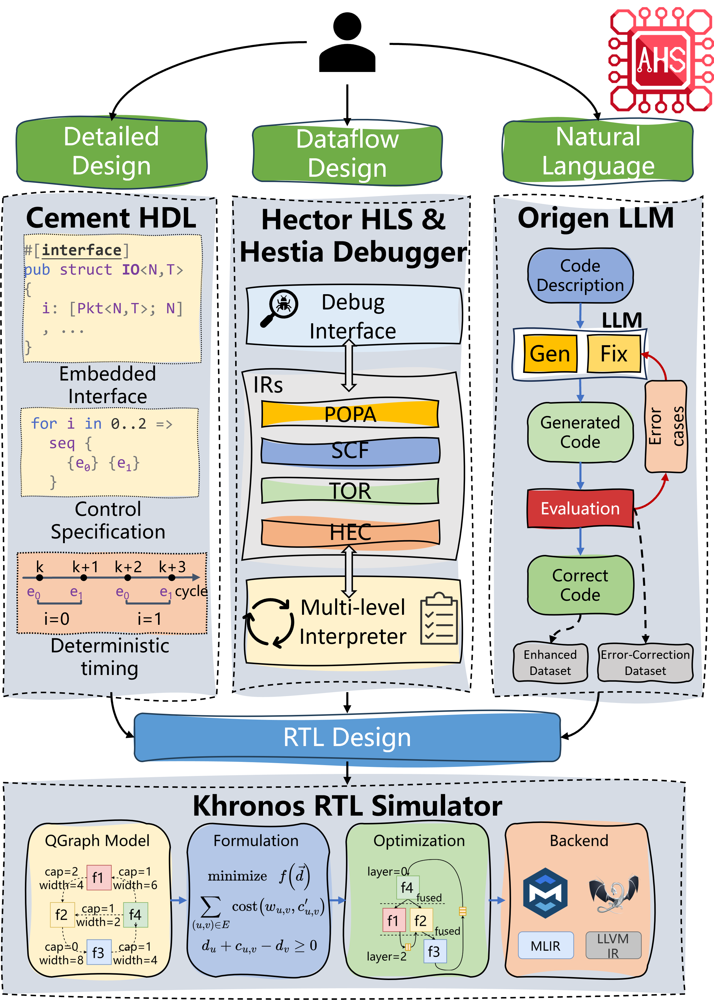

AHS: An EDA toolbox for Agile Chip Front-end Design
============================

Overview
--------

Compared to software design, hardware design is more expensive and time-consuming. This is partly because software community has developed a rich set of modern tools to help software programmers to get projects started and iterated easily and quickly. However, the tools are seriously antiquated and lacking for hardware design. Modern digital chips are still designed manually using hardware description language such as Verilog or VHDL, which requires low-level and tedious programming, debugging, and tuning. In this tutorial, we will introduce Agile Hardware Specialization (AHS) : A toolbox for Agile Chip Front-end Design. 

The tutorial will highlight the methodology and open source tools in AHS for both chip design and verification. From the design perspective, AHS present three ways that use different programming interfaces and target different scenarios, including; 1) a multi-level hardware intermediate representation based high-level synthesis flow, which uses C and C++ as the programming language; 2) an embedded hardware description language, which uses Rust as the programming language; 3) a large language model (LLM)-powered hardware design flow, which uses natural language as the programming language. These three different methodologies exhibit different trade-offs in productivity and PPA (performance, power, and area) for chip design. From the verification perspective, we will present agile simulation and debugging tools, which can check the functional and performance behaviors of the hardware. The attendees will learn the methodology, design automation fundamentals, and software tools of AHS.

Setup
-----

We provide both Docker and local setup. See :ref:`Setup<setup_label>` page for details.

Schedule
--------

Organizers
----------

Related papers
--------------

Git Repos
---------

* `POPA`_  
* `Hector`_
* `Hestia`_
* `Cement`_: Rust crates: `cmtrs`_, `cmtc`_; Documents: `docs.rs/cmtrs`_, `docs.rs/cmtc`_
* `Ksim`_
* `Origen`_

.. _POPA: https://github.com/pku-liang/popa/tree/mlir
.. _Hector: https://github.com/pku-liang/Hector/tree/tutorial-aspdac
.. _Hestia: https://github.com/pku-liang/hestia/tree/main
.. _Cement: https://github.com/pku-liang/cement/tree/cmt2
.. _Ksim: https://github.com/pku-liang/ksim/tree/aspdac24-tutorial
.. _Origen: https://github.com/pku-liang/OriGen/tree/main
.. _cmtrs: https://crates.io/crates/cmtrs
.. _cmtc: https://crates.io/crates/cmtc
.. _docs.rs/cmtrs: https://docs.rs/cmtrs/latest/cmtrs/
.. _docs.rs/cmtc: https://docs.rs/cmtc/latest/cmtc/

.. toctree::
   :maxdepth: 2
   :caption: Contents:

   step
